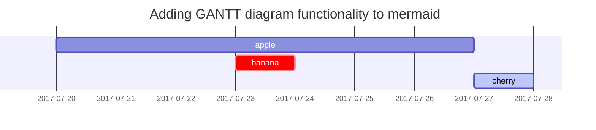

## Project Overview

As a part of my summer internship at the Advanced Course in Engineering, I had the oppurtunity to conduct research for the Ministry of Defence (MOD) in the U.K. The main focus of my research of was Operational Technology (OT) security. The goal of my research team of six engineers was to provide an educative Operational Technology exercise for newcomers to OT attending Defence Cyber Marvel (DCM).

### Our project requirements from MOD Were As Follows: 

1. Solution must be created from commercial off the shelf products and open-source software
2. The training excercise should take up 60-90 minutes
3. Provide full documentation for Defense Cyber Marvel organizers to rebuild and re-create the project 

### My Contributions

For my role on the team I was tasked with researching and developing exploits for our training environment. I created Modbus exploits written in Python, Go, and Nim that were designed to deny legitimate traffic from our human machine interface to our simulated programmable logic controllers. Beyond the technical implementation of these exploits, I created written reports outlining how these attacks worked, and how OT professionals could counter these threats. Beyone communicating the work that I did, I also collected information about real world attacks and condensed the information to a beginner knowledge level.

### Takeaways

* In-depth understanding of Operational Technology <br>
* Enhanced technical writing skills <br>
* Broadened idea of the application of security concepts beyond Information Technology


## Block Quote

> This line shows the _block quote_.

## Prompts

<!-- markdownlint-capture -->
<!-- markdownlint-disable -->
> An example showing the `tip` type prompt.
{: .prompt-tip }

> An example showing the `info` type prompt.
{: .prompt-info }

> An example showing the `warning` type prompt.
{: .prompt-warning }

> An example showing the `danger` type prompt.
{: .prompt-danger }
<!-- markdownlint-restore -->

## Tables

| Company                      | Contact          | Country |
| :--------------------------- | :--------------- | ------: |
| Alfreds Futterkiste          | Maria Anders     | Germany |
| Island Trading               | Helen Bennett    |      UK |
| Magazzini Alimentari Riuniti | Giovanni Rovelli |   Italy |


## Footnote

Click the hook will locate the footnote[^footnote], and here is another footnote[^fn-nth-2].


## Code blocks

### Common

```text
This is a common code snippet, without syntax highlight and line number.
```

### Specific Language

```bash
if [ $? -ne 0 ]; then
  echo "The command was not successful.";
  #do the needful / exit
fi;
```

### Specific filename

```sass
@import
  "colors/light-typography",
  "colors/dark-typography";
```
{: file='_sass/jekyll-theme-chirpy.scss'}

## Mathematics

The mathematics powered by [**MathJax**](https://www.mathjax.org/):

$$
\begin{equation}
  \sum_{n=1}^\infty 1/n^2 = \frac{\pi^2}{6}
  \label{eq:series}
\end{equation}
$$

We can reference the equation as \eqref{eq:series}.

When $a \ne 0$, there are two solutions to $ax^2 + bx + c = 0$ and they are

$$ x = {-b \pm \sqrt{b^2-4ac} \over 2a} $$

## Mermaid SVG



## Images

### Default (with caption)

{: width="972" height="589" }
_Full screen width and center alignment_

### Left aligned

{: width="972" height="589" .w-75 .normal}

### Float to left

{: width="972" height="589" .w-50 .left}
Praesent maximus aliquam sapien. Sed vel neque in dolor pulvinar auctor. Maecenas pharetra, sem sit amet interdum posuere, tellus lacus eleifend magna, ac lobortis felis ipsum id sapien. Proin ornare rutrum metus, ac convallis diam volutpat sit amet. Phasellus volutpat, elit sit amet tincidunt mollis, felis mi scelerisque mauris, ut facilisis leo magna accumsan sapien. In rutrum vehicula nisl eget tempor. Nullam maximus ullamcorper libero non maximus. Integer ultricies velit id convallis varius. Praesent eu nisl eu urna finibus ultrices id nec ex. Mauris ac mattis quam. Fusce aliquam est nec sapien bibendum, vitae malesuada ligula condimentum.

### Float to right

{: width="972" height="589" .w-50 .right}
Praesent maximus aliquam sapien. Sed vel neque in dolor pulvinar auctor. Maecenas pharetra, sem sit amet interdum posuere, tellus lacus eleifend magna, ac lobortis felis ipsum id sapien. Proin ornare rutrum metus, ac convallis diam volutpat sit amet. Phasellus volutpat, elit sit amet tincidunt mollis, felis mi scelerisque mauris, ut facilisis leo magna accumsan sapien. In rutrum vehicula nisl eget tempor. Nullam maximus ullamcorper libero non maximus. Integer ultricies velit id convallis varius. Praesent eu nisl eu urna finibus ultrices id nec ex. Mauris ac mattis quam. Fusce aliquam est nec sapien bibendum, vitae malesuada ligula condimentum.

### Dark/Light mode & Shadow

The image below will toggle dark/light mode based on theme preference, notice it has shadows.

{: .light .w-75 .shadow .rounded-10 w='1212' h='668' }
{: .dark .w-75 .shadow .rounded-10 w='1212' h='668' }

## Video



## Reverse Footnote

[^footnote]: The footnote source
[^fn-nth-2]: The 2nd footnote source
